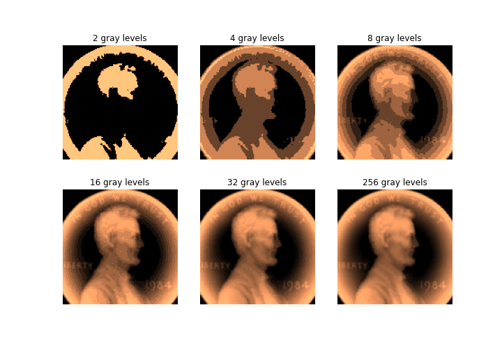

# Digitalized Signals in Time and Space
To view the class slides, make sure you have [rise](https://github.com/damianavila/RISE) installed for your jupyter notebook, and use `jupyter notebook` to open the notebook, and click on the `rise` plugin button. (The slides doesn't work with with `jupyter lab`)

## Assignment:
Again, create your own local repository, and using the same `conda` environment from the previous assignment, reproduce the figures on slides 2, 3, and 11. Make sure you work on your assignment in a `submission` branch, and push this `submission` branch to a remote GitHub repository after completion:

- Slide 2:
 

- Slide 3:
 

- Slide 11:
 

Submit your assignment as a pull request on GitHub, merging your `submission` branch into your `main` or `master` branch. Then add `axiezai@gmail.com` as a reviewer to your pull request. 
