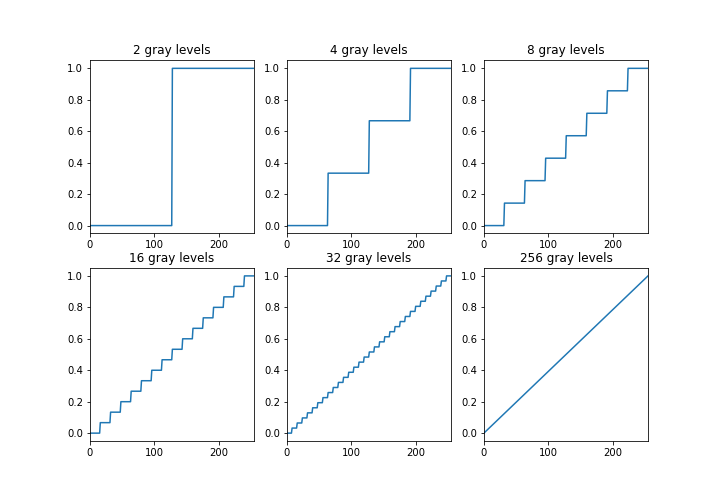
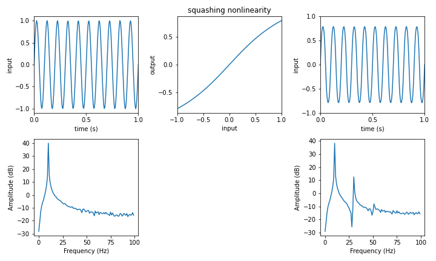

<p style="text-align:center; font-size:80px">
    <b>
        Introduction to Digital Signals
    </b>
</p>

Digital signals are sampled and discretized:
---
<center>

</center>

Discretization
---
<center>

</center>

Discretization is a nonlinear process
---
<center>

</center>

Non-linear Amplification
---
Non-linearity creates artifacts in the frequency domain

<center>

</center>

Discretization
---
Math-y expression explaining harmonic distortions:

$$ x(t) = sin(\omega t) $$

$$ y(t) = x^2(t) = \sin^2(\omega t) = \frac{1}{2} - \frac{1}{2}\cos(2\omega t)$$

$$ y(t) = \sin^3(\omega t) = \frac{3}{4}\sin(\omega t) - \frac{1}{4}\sin(3\omega t)$$

Fourier Transform
---
The Fourier transform takes a function of time $f(t)$ and maps it to a function of frequency $F(\omega)$

<center>
    
</center>

Complex Numbers
---
Fourier Transform takes advantage of complex numbers in analyzing time-varying quantities:

$$ z = |z|\exp(i\omega t) = |z|(\cos\omega t + i\sin\omega t)$$

<center>
    

Sampling
---

If the signal is sampled every $\Delta t$ (in seconds), the sampling frequency (Hz $= s^-1$) is given by:
$$ f_s = \frac{1}{\Delta t} $$

For images the resolution is given by pixel size $\Delta x$ (in cm) or as pixels per cm: 
$$ f_s = \frac{1}{\Delta x} $$

The sampling theorem states that one has to sample a signal at least twice the frequency of the highest oscillation.

For example: a 10Hz oscillation has to be sampled at least every 1/20s.

Sampling
---

If we violate that requirement, we get distortions. In imaging, it's called aliasing:

Example: $f(x,y)=|\sin(x^2 + y^2)|$. 720x240 pixels and amplitude scaled to $[0, 255]$ and discretized. Bad sampling will result in artifacts in space.

<center>
    
</center>

Useful Python commands used:
---
```python
plt.figure().subplots(rows, cols) # create a figure with rows x cols subplots.
plt.subplot(2, 2, 1) # subplot in the 1st axes
plt.plot(t, y)
plt.stem(t, y)

P = plt.imread('penny.jpg').copy() # load the penny image
plt.set_cmap(plt.get_cmap('copper')) # make copper the default colormap for your penny figure

[x, y] = np.meshgrid(a, b) # Generate a grid. Each row (x) is a copy of a, and each column (Y) is a copy of b. 

# functions:
# For RGB - Grayscale conversion
def rgb2gray(rgb):
    coeffs = np.array([0.299, 0.587, 0.114])
    return np.dot(rgb, coeffs)
```


```python

```
